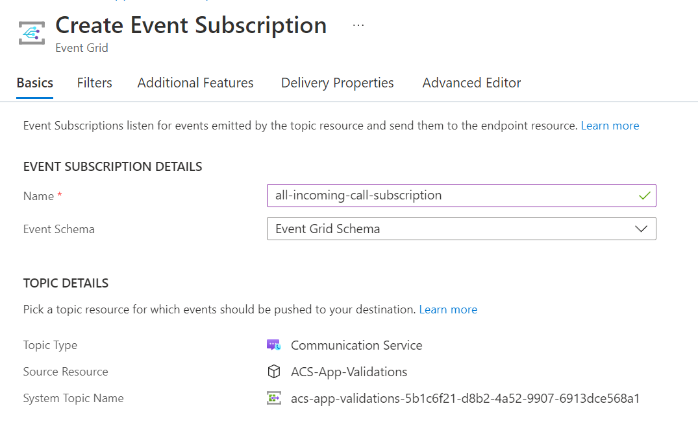

# Incoming call Media Streaming Sample

Get started with audio media streaming out, through Azure Communication Services. This QuickStart assumes you’ve already used the calling automation APIs to build an automated call routing solution, please refer [Incoming call Sample](https://link_of_incoming_call_sample/).

In this sample a WebApp receives an incoming call request whenever a call is made to a phone number or a communication identifier. API first answers the call and makes PSTN external user say something.
The audio is streamed to WebSocket server and generates log events to show media streaming is happening on the server.
It supports Audio streaming only (mixed/unmixed format).

This sample has 3 parts:
1. ACS Resource IncomingCall Hook Settings, and ACS Phone Number.
2. IncomingCall WebApp - for accepting the incoming call with Media Options settings.
3. WebSocketListener – Listen to media stream on websocket.

The application is a console-based application build on Java development kit(JDK) 11.

## Getting started

### Prerequisites

- Create an Azure account with an active subscription. For details, see [Create an account for free](https://azure.microsoft.com/free/)
- [Java Development Kit (JDK) version 11 or above](https://docs.microsoft.com/azure/developer/java/fundamentals/java-jdk-install)
- [Apache Maven](https://maven.apache.org/download.cgi)
- Create an Azure Communication Services resource. For details, see [Create an Azure Communication Resource](https://docs.microsoft.com/azure/communication-services/quickstarts/create-communication-resource). You'll need to record your resource **connection string** for this sample.
- [Configuring the webhook](https://docs.microsoft.com/en-us/azure/devops/service-hooks/services/webhooks?view=azure-devops) for **Microsoft.Communication.IncomingCall** event.
- Download and install [Ngrok](https://www.ngrok.com/download). As the sample is run locally, Ngrok will enable the receiving of all the events.

## Before running the sample for the first time

1. Open an instance of PowerShell, Windows Terminal, Command Prompt or equivalent and navigate to the directory that you'd like to clone the sample to.
2. git clone https://github.com/Azure-Samples/Communication-Services-java-quickstarts.git.

### Locally running the media streaming WebSocket app
 and update below configurations.
1. Navigate to IncomingCallMediaStreaming, look for the file at /src/main/java/com/communication/IncomingCallMediaStreaming/WebSocket/App.java
2. Run the `WebSocket/App.java` for listening media stream on websocket.
3. Run ngrok using command `ngrok http 8080 --host-header="localhost:8080"`
3. Use the ngrok-URL, as a websocket URL needed for `MediaStreamingTransportURI` configuration.

### Publish  the Incoming call media streaming to Azure WebApp
1.
2.
3. After publishing, add the following configurations on azure portal (under app service's configuration section).

	- Connectionstring: Azure Communication Service resource's connection string.
	- AppCallBackUri: URI of the deployed app service.
	- SecretPlaceholder: Query string for callback URL.
	- MediaStreamingTransportURI: websocket URL got from `WebSocketListener`, format "wss://{ngrokr-url}",(Notice the url, it should wss:// and not https://).

### Create Webhook for incoming call event

IncomingCall is an Azure Event Grid event for notifying incoming calls to your Communication Services resource. To learn more about it, see [this guide](https://learn.microsoft.com/en-us/azure/communication-services/concepts/call-automation/incoming-call-notification).
1. Navigate to your resource on Azure portal and select `Events` from the left side menu.

2. Select `+ Event Subscription` to create a new subscription.
3. Filter for Incoming Call event.
4. Choose endpoint type as web hook and provide the public url generated for your application by ngrok. Make sure to provide the exact api route that you programmed to receive the event previously. In this case, it would be <ngrok_url>/api/incomingCall.

	
	

5. Select create to start the creation of subscription and validation of your endpoint as mentioned previously. The subscription is ready when the provisioning status is marked as succeeded.

### Run the Application

- Navigate to the directory containing the pom.xml file and use the following mvn commands:
	- Compile the application: mvn compile
	- Build the package: mvn package
	- Execute the app: mvn exec:java
